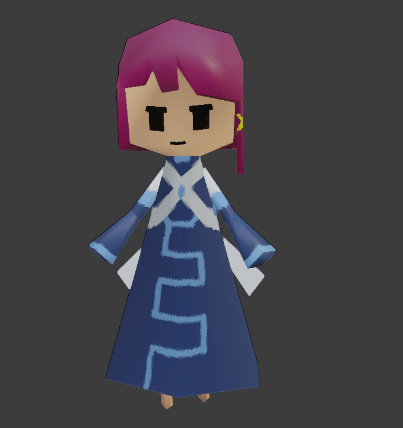

# README
serial experiments lain Advent Calendar 2021 11日目

## 本題
作りかけのローポリ(238△)ペルソナさんがいたので、手直しをしてアニメーションをつけてみました。
作業で使用したプロジェクトファイルは [./.blend/persona.blend](./.blend/persona.blend) に配置しています。

## 独り言
2021年12月24日に[lain立体物の企画](https://twitter.com/cafe_darkmatter/status/1331678062501535746)があるそうな。
丁度[このリポジトリの中](./pdf/ペーパークラフト図面.pdf)にペーパークラフトに使えそうな図面があるので、
誰でもペルソナさんの立体物作れる状態だな...。
しかも図面から画像を抜いたデータもあるので、
これは各人塗り絵をしてデザインを変えたペルソナさんペーパークラフトが自由につくれちゃったりするな...。

## LICENSE
このリポジトリ内のアセットは [LICENSE](./LICENSE) のもと公開されています。
使用の際は必ず確認してください。

## 参考
[【第０回】ワニでもできる！モデリングforVRChat](https://www.youtube.com/watch?v=Xg4AXYuzEqA)
